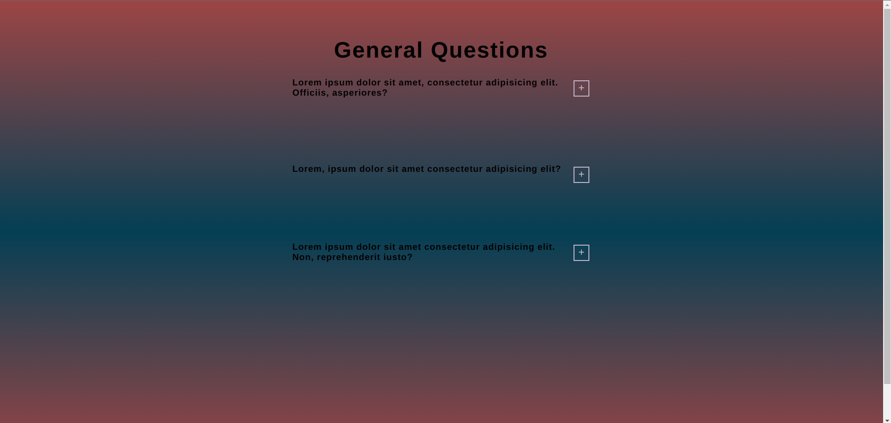
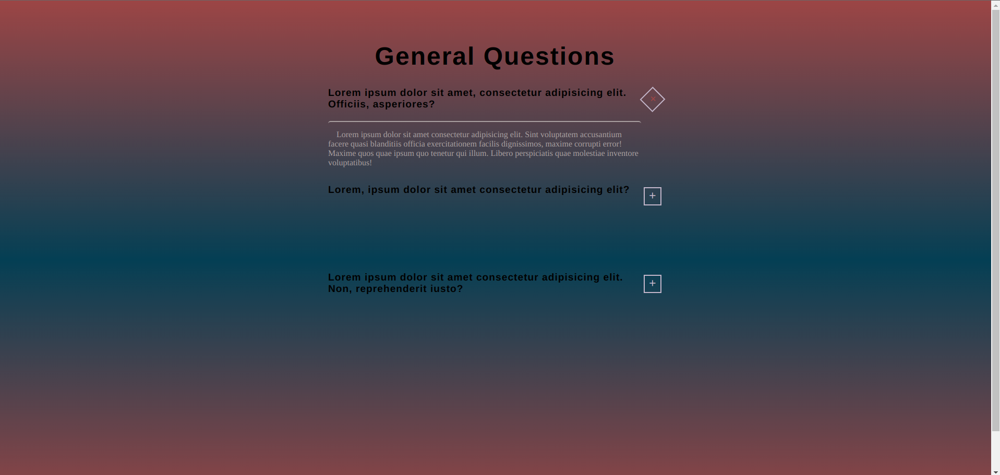

# QUESTIONS PROJECT

## FULLSTACK PRACTICE PROJECT NO: 7

1. A fullstack version of my previous frontend project to practice my skills using Javascript, Jquery, NodeJS, ExpressJS, HTML, CSS.

2. On load there are frequently asked questions. When we click to button on right it displays the answer. On second click turns off.
